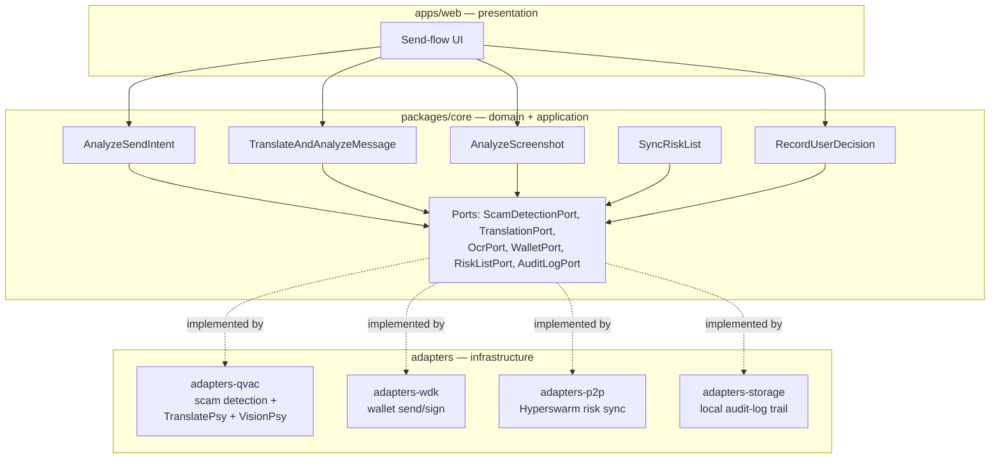
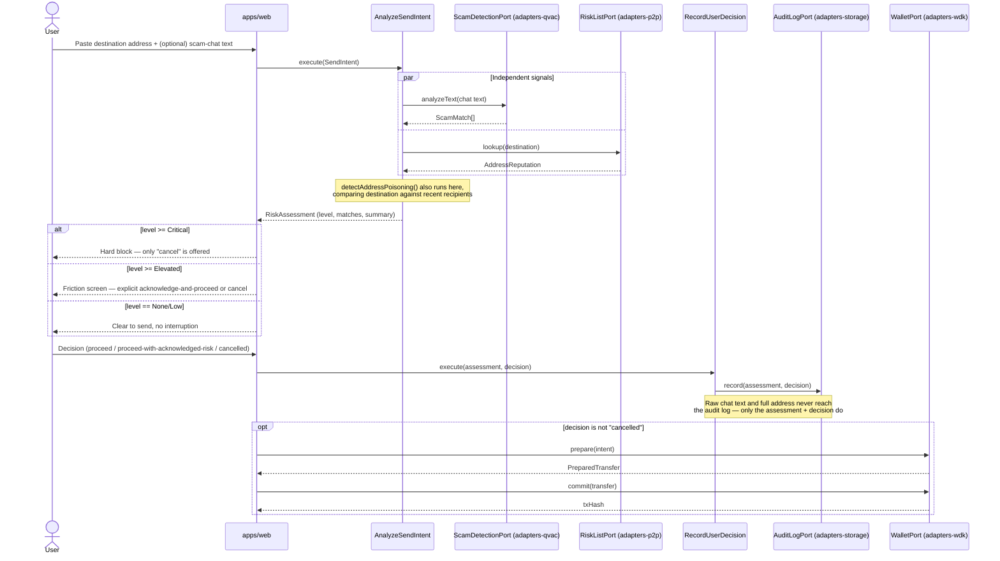
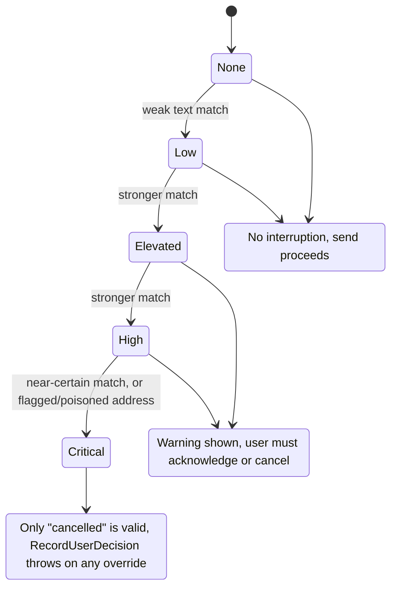

# Architecture

Custos follows a hexagonal / clean-architecture split so the fraud-detection
logic never depends on QVAC, WDK, or Hyperswarm directly — those are adapters
behind ports, swappable and independently testable.

## Layers

### `packages/core` — domain + application

Pure TypeScript. No SDK imports, no network calls, no platform APIs. Contains:

- **Entities**: `Address`, `ChatMessage`, `RiskAssessment`, `ScamPattern`, `SendIntent`.
- **Value objects**: `RiskLevel`, `Language`.
- **Ports** (interfaces the application layer depends on, implemented by adapters):
  `ScamDetectionPort`, `TranslationPort`, `OcrPort`, `WalletPort`, `RiskListPort`, `AuditLogPort`.
- **Use cases** (application services, one per user-facing action):
  `AnalyzeSendIntent`, `TranslateAndAnalyzeMessage`, `AnalyzeScreenshot`,
  `SyncRiskList`, `RecordUserDecision`.

This package is unit-testable with zero mocking infrastructure beyond
hand-written fakes of the ports — that's the point of the boundary.

### `packages/adapters-qvac`

Implements `ScamDetectionPort` (local LLM + seeded rules over
`@qvac/sdk`), `TranslationPort` (TranslatePsy), and `OcrPort` (VisionPsy,
stretch). This is the only package allowed to import `@qvac/sdk`.

### `packages/adapters-wdk`

Implements `WalletPort`: builds the USDT transfer, exposes a pre-sign hook so
the application layer can interpose the risk warning before WDK actually signs
and broadcasts.

### `packages/adapters-p2p` (stretch)

Implements `RiskListPort` over Hyperswarm: joins a topic swarm, gossips
confirmed-scam addresses, persists them to a local cache consumed by
`AnalyzeSendIntent`.

### `packages/adapters-storage`

Implements `AuditLogPort`: persists each `RiskAssessment` + `SendDecision`
pair to `localStorage` (bounded history), falling back to in-memory-only
where storage isn't available. Never receives raw chat text or the full
destination address — the port's signature doesn't allow it.

### `packages/shared`

Seed scam-pattern dataset (`scam-patterns.json`) and cross-package types with
no SDK dependencies.

### `apps/web`

Thin presentation layer: paste chat/address → call `AnalyzeSendIntent` /
`TranslateAndAnalyzeMessage` → render warning/block UI → call `WalletPort.send`
on explicit confirmation. Contains no business logic — every decision (is this
risky? what's the message?) lives in `core`.

## Send flow

The sequence below is the one path every other diagram in this doc exists to
support: what actually happens, in order, between pasting an address and a
transaction landing on-chain (or not).

## Risk-level state machine

`RiskLevel` is ordered (`None < Low < Elevated < High < Critical`) precisely so
the friction policy can be two threshold checks instead of a lookup table —
see `requiresFriction` / `requiresHardBlock` in
`packages/core/src/domain/value-objects/RiskLevel.ts`.

## Why this split matters for the judged criteria

- **Technical (35%)**: the QVAC/WDK/Hyperswarm boundary is enforced by the
  port interfaces, not by convention — swapping mock adapters in for local dev
  (no device with QVAC installed) is a constructor argument, not a rewrite.
- **Completion (10%)**: use cases and adapters ship independently — a judge can
  see `core`'s tests pass even before every adapter is fully wired.
- **Design (10%)/Impact (20%)**: keeping the send-interception moment
  (`WalletPort` pre-sign hook) as a first-class concept in the domain, not
  buried in UI code, is what makes the "block before signing" story demoable
  and legible in review.
