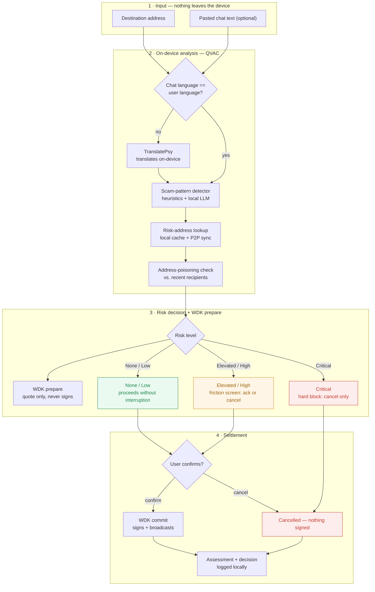

# Custos

[](https://youtu.be/3LAOwk1f-Oo)
[](https://custos-one-sand.vercel.app)
[](https://nile.tronscan.org)

**On-device anti-scam shield for USDT sends.** Before a transfer is signed, Custos
analyzes the destination address and the pasted scam-chat context entirely on the
user's device — no chat content, no address, no screenshot ever leaves the phone
for inference — and warns or blocks the send when it matches a known fraud
pattern. Risk addresses are optionally shared peer-to-peer, with no central
server to trust or censor.

Built for the [Decentralized AI Hackathon](https://www.trydojo.io/hackathons/decentralized-ai-hackathon)
(ISD Summit, Panama, Sept 9–11 2026).

## Demo

| | |
|---|---|
| **▶ Demo video** | **https://youtu.be/3LAOwk1f-Oo** |
| **🌐 Live demo** | **https://custos-one-sand.vercel.app** |

[](https://youtu.be/3LAOwk1f-Oo)

The live demo runs on **Tron Nile testnet** and creates its own wallet in your
browser, so there is nothing to install. Approved transfers are really signed and
broadcast, and return a transaction hash you can open on Tronscan. To sign, the
wallet needs testnet TRX (gas) and testnet USDT: copy its address from the
**Escudo** tab and top it up at the [Nile faucet](https://nileex.io/join/getJoinPage).

## Why this exists

*Pig butchering*, wallet-drainer phishing, and fake-support scams move billions
in USDT every year. Exchanges, wallets, and PSPs want to protect users, but they
can't ship a cloud-based fraud detector: the chat context and transaction intent
are exactly the kind of sensitive user data compliance teams won't let leave the
device. And centralized risk-address lists are a single point of failure and
censorship. Nobody is solving this with **on-device AI + P2P** today.

Many of these scams are also run by non-native-language scripts against
non-native-language victims — a Spanish-speaking victim reading a scam script
copy-pasted from a Chinese or English playbook is exactly where translation
quality determines whether the pattern-matcher ever sees the real signal. That's
why translation isn't a side feature here — it's in the critical path.

## Tracks this targets and why

| Track | Fit | Rationale |
|---|---|---|
| **03 — Sovereign Intelligence at the Edge** ($6,000) | ✅ Primary | Fraud detection on sensitive transaction/chat data, inference fully on-device via `@qvac/sdk`, works with intermittent connectivity, P2P risk-list sync via Pears/Hyperswarm as the valued (not required) bonus. |
| **02 — Tether QVAC Psy** ($1,500) | ✅ Primary | `TranslatePsy` is load-bearing in the main flow (see below), not a cosmetic add-on. `VisionPsy` is a stretch goal for screenshot/QR OCR. |
| **01 — Philips Installed-Base Intelligence** ($1,500) | ❌ Not pursued | Different domain (hospital field-service equipment tracking) — no honest way to bridge it to a payments-fraud product without faking relevance. Deliberately skipped rather than bolted on. |

### Where each Psy model is actually load-bearing (not decorative)

- **TranslatePsy** — the chat-context box accepts scam text in any language;
  it's translated on-device before the scam-pattern detector runs. This directly
  serves the cross-border-scam scenario described above. **Central to the main
  user flow.**
- **VisionPsy** *(stretch)* — OCR of pasted screenshots (fake trading dashboards,
  QR codes containing a destination address) so the same detector can run on
  image-borne scams, not just text.
- **MedPsy** — not used; out of domain.

## How it works

1. User pastes the scammer's chat text (optional) and/or the destination
   address into Custos before confirming a USDT send in their wallet.
2. If the chat text isn't in the user's language, `TranslatePsy` translates it
   on-device.
3. The (translated) text + address are run through the local scam-pattern
   detector (`@qvac/sdk` inference — seeded rules + small on-device LLM) for
   known playbooks: fake investment platforms, "recovery agent" scams, urgency/
   secrecy pressure, mismatched sender identity, etc.
4. The destination address is checked against the local risk-address cache,
   synced peer-to-peer over Hyperswarm (Pears Stack) — no central blocklist
   server — and against the user's own send history for address-poisoning
   lookalikes.
5. WDK `prepare`s the transfer (quote only — this never signs) so a fee/quote
   is available the moment the risk screen renders.
6. If risk is detected, Custos surfaces a friction screen *before* WDK is ever
   asked to `commit` — the user must explicitly acknowledge the warning to
   proceed, or cancel. A Critical assessment allows only "cancel"; `commit` is
   never reachable from that state, enforced both in the UI (no proceed
   button rendered) and in `RecordUserDecision` (throws if the decision isn't
   `cancelled`).
7. Every assessment and decision (not the raw chat content) is logged locally
   for the user's own audit trail.



See [ARCHITECTURE.md](./ARCHITECTURE.md#send-flow) for the full sequence
diagram (every port/adapter involved) and the risk-level state machine.

## Tech stack

| Piece | Technology | Role |
|---|---|---|
| On-device AI | **QVAC SDK** (`@qvac/sdk`) | Scam-pattern inference, fully local |
| Cross-language detection | **TranslatePsy** (QVAC Psy) | On-device translation of pasted scam scripts before analysis |
| Image-borne scam detection *(stretch)* | **VisionPsy** (QVAC Psy) | OCR of screenshots/QR codes |
| Wallet | **WDK** | Self-custodial USDT wallet: builds, signs, and broadcasts the transfer once the user clears or overrides the warning |
| P2P risk-list sync *(stretch)* | **Pears Stack (Hyperswarm)** | Peer-to-peer propagation of confirmed scam addresses, no central server |
| App shell | TypeScript, Vite + React | Demo UI for the send flow |

No inference call in this app is ever routed to a cloud API. The only network
calls in the codebase are non-inference: serving the static UI bundle and (if
enabled) Hyperswarm P2P sync of the risk-address list, which is itself a
decentralized peer swarm, not a centralized service.

## Repository layout

See [ARCHITECTURE.md](./ARCHITECTURE.md) for the full breakdown. Summary:

```
packages/
  core/             domain entities + use cases, zero I/O, zero SDK imports
  adapters-qvac/    @qvac/sdk: scam detection, TranslatePsy, VisionPsy
  adapters-wdk/     WDK wallet integration (send flow, pre-sign hook)
  adapters-p2p/     Hyperswarm risk-address list sync (stretch)
  adapters-storage/ local audit-log trail (assessments + decisions only)
  shared/           seed scam-pattern dataset, shared types
apps/
  web/             demo UI: paste chat/address → analyze → warn/block → send
docs/
  demo-script.md          shot list for the ≤5 min submission video
  compliance-checklist.md live checklist against the official rules
  performance-log.md      QVAC model load / prompts / token count / TTFT / throughput (Track 02 deliverable)
```

## Setup

Requirements: Node 20+, [pnpm](https://pnpm.io) 9+, and the QVAC SDK runtime for
your platform (see [qvac.tether.io](https://qvac.tether.io) for device/hardware
requirements — document the exact hardware used for testing in
`docs/performance-log.md`).

```bash
pnpm install
pnpm build
pnpm dev:web
```

`adapters-wdk` is wired to Tether WDK for Tron USDT (`prepare` quotes, `commit` signs and broadcasts) and is gated behind `apps/web`'s friction/block screen — see "How it works" below. `adapters-qvac` has scam detection, TranslatePsy, and VisionPsy all wired to `@qvac/sdk`; each still degrades gracefully (heuristics-only / untranslated / empty OCR) when constructed without a real model client. `adapters-p2p` gossips confirmed reports over Hyperswarm behind the same optional-client pattern. None of the QVAC or Hyperswarm clients are constructed in `apps/web`'s browser build — they need a Node/Bare/Expo host; see each package README.

## Disclosed external services / third-party components

*(Required disclosure per hackathon rules — keep this list current.)*

Wired on-device SDKs (in `package.json` today):

- `@qvac/sdk` `0.19.0`: Tether QVAC SDK, on-device inference (scam detection, TranslatePsy, and VisionPsy all wired). Classification/translation use Llama 3.2 1B Instruct Q4_0; VisionPsy uses the EasyOCR Latin registry model.
- `@tetherto/wdk-wallet-tron` `1.0.0-beta.13`: Tether WDK Tron wallet module. Self-custodial USDT TRC-20 transfers. Local signing. Tron RPC is used only to quote and broadcast, never for inference.
- `hyperswarm` `^4.17.1`: Pears Stack P2P discovery/gossip for the risk-address list — no central server, direct peer connections only. Stretch goal, now wired behind `HyperswarmRiskListAdapter`'s injectable client (see `adapters-p2p`).

None of `@qvac/sdk`, WDK, or `hyperswarm` are constructed in `apps/web`'s
browser bundle — see `apps/web/src/compositionRoot.ts` — since a real signing
key must never ship in a browser build and Hyperswarm needs raw UDP/DHT
access a browser doesn't have. They're wired and unit-tested at the adapter
level, ready for a Node/Bare/Expo host.

Build & UI tooling (already in `package.json`, dev-time/build-time only —
none of these run inference, call a remote API, or collect analytics):

- React / ReactDOM — `apps/web` UI.
- Vite (`@vitejs/plugin-react`) — dev server and build for `apps/web`.
- TypeScript — compilation across all packages.
- Vitest — test runner for `packages/*`.

No cloud inference APIs, no analytics SDKs, no third-party trackers.
Any additional library added during the hackathon must be listed here before
submission.

## Compliance checklist (Tether Developers Cup / Decentralized AI Hackathon)

See [docs/compliance-checklist.md](./docs/compliance-checklist.md) for the
live, checkable version. Deadline: **2026-09-11, 08:00 Panama time**.

## Status

Early scaffold — architecture and ports are in place; SDK wiring and the demo
UI are tracked in GitHub Issues.

## License

MIT — see [LICENSE](./LICENSE).
