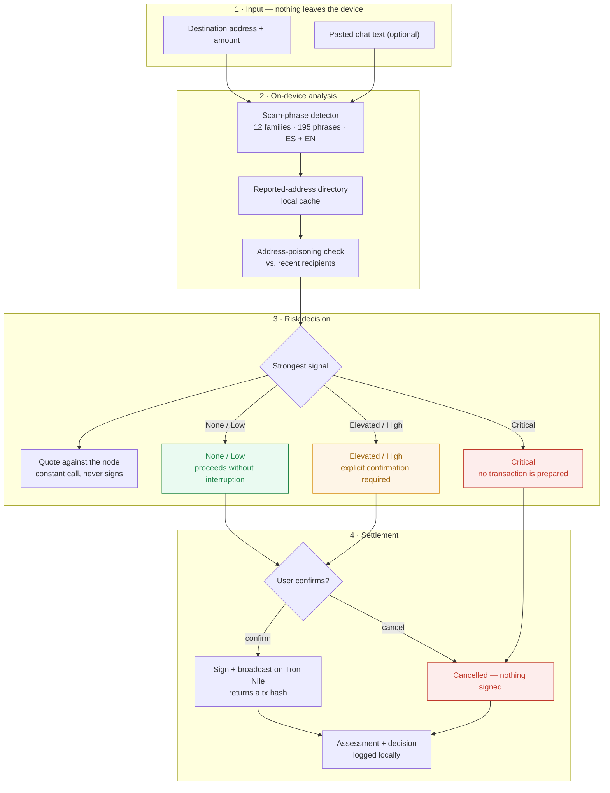

# Custos

[English](./README.md) · **[Español](./README.es.md)**

[](https://youtu.be/3LAOwk1f-Oo)
[](https://custos-one-sand.vercel.app)
[](https://nile.tronscan.org)

**On-device anti-scam shield for USDT sends.** Before a transfer is signed, Custos
analyzes the destination address and the pasted scam-chat context entirely on the
user's device — no chat content, no address, no screenshot ever leaves the phone
for inference — and warns or blocks the send when it matches a known fraud
pattern. Risk addresses are optionally shared peer-to-peer, with no central
server to trust or censor.

Built for the [Decentralized AI Hackathon](https://www.trydojo.io/hackathons/decentralized-ai-hackathon)
(ISD Summit, Panama, Sept 9–11 2026).

## Demo

| | |
|---|---|
| **▶ Demo video** | **https://youtu.be/3LAOwk1f-Oo** |
| **🌐 Live demo** | **https://custos-one-sand.vercel.app** |

[](https://youtu.be/3LAOwk1f-Oo)

The live demo runs on **Tron Nile testnet** and creates its own wallet in your
browser, so there is nothing to install. Approved transfers are really signed and
broadcast, and return a transaction hash you can open on Tronscan. To sign, the
wallet needs testnet TRX (gas) and testnet USDT: copy its address from the
**Escudo** tab and top it up at the [Nile faucet](https://nileex.io/join/getJoinPage).

## Why this exists

*Pig butchering*, wallet-drainer phishing, and fake-support scams move billions
in USDT every year. Exchanges, wallets, and PSPs want to protect users, but they
can't ship a cloud-based fraud detector: the chat context and transaction intent
are exactly the kind of sensitive user data compliance teams won't let leave the
device. And centralized risk-address lists are a single point of failure and
censorship. Nobody is solving this with **on-device AI + P2P** today.

Many of these scams are also run by non-native-language scripts against
non-native-language victims — a Spanish-speaking victim reading a scam script
copy-pasted from a Chinese or English playbook is exactly where translation
quality determines whether the pattern-matcher ever sees the real signal. That's
why translation isn't a side feature here — it's in the critical path.

## Tracks this targets and why

| Track | Fit | Rationale |
|---|---|---|
| **03 — Sovereign Intelligence at the Edge** ($6,000) | ✅ Primary | Fraud detection on sensitive transaction and chat data, analyzed entirely on the user's device. Nothing is sent to a cloud API, and the settlement path is self-custodial. |
| **02 — Tether QVAC Psy** ($1,500) | ✅ Primary | The cross-language problem is load-bearing, not cosmetic: the detector ships its phrase list in Spanish and English because scam scripts are translated between languages. `VisionPsy`'s OCR path is implemented and working in the browser. |
| **01 — Philips Installed-Base Intelligence** ($1,500) | ❌ Not pursued | Different domain (hospital field-service equipment tracking) — no honest way to bridge it to a payments-fraud product without faking relevance. Deliberately skipped rather than bolted on. |

### Where each Psy capability sits, and what actually ships

- **VisionPsy (OCR)** — **working in the deployed build.** Upload a screenshot of
  a chat or a fake trading dashboard and the text and any destination address are
  extracted on device, then run through the same scam detector. It is backed by
  `tesseract.js` in a Web Worker rather than QVAC's native model, because
  `@qvac/sdk` cannot load in a browser bundle. The privacy claim is unchanged:
  the image never leaves the machine.
- **TranslatePsy** — the adapter is written against `TranslationPort`, and it is
  what runs when the app is hosted on Bare or Node. In the browser build the
  cross-language problem is solved differently: the phrase list itself is
  bilingual and accent-insensitive, so a Spanish scam script is caught without a
  translation pass.
- **MedPsy** — not used; out of domain.

## How it works

This is the flow the deployed web build actually runs:

1. You paste the destination address, the amount, and optionally the scammer's
   chat message.
2. Everything is analyzed **in the browser**. Three independent signals run:
   scam-phrase matching over 12 fraud families (195 phrases, Spanish and
   English, accent-insensitive), an address-poisoning check against your send
   history, and a lookup in the local directory of reported addresses.
3. The strongest signal sets the risk level (see the table below).
4. If the send is not blocked, the transfer is quoted against a Tron node with a
   constant call. This reads the real energy cost and **never signs anything**.
5. The risk level decides the friction: proceed, demand an explicit
   confirmation, or refuse to prepare a transaction at all.
6. On confirmation, the transfer is signed in the browser and broadcast to Tron
   Nile, returning a transaction hash you can open on Tronscan.
7. The assessment and the decision are written to a local audit log. The chat
   text never is.

### How risk is scored

Signals are independent and the strongest one wins, so any single signal can
raise the level on its own.

| Signal | Confidence | Resulting level | What the app does |
|---|---|---|---|
| Address already reported | forced | **Critical** | No transaction is prepared. There is nothing to sign. |
| Address poisoning (same first and last 6 chars as a past recipient) | 0.90 | **Critical** | Same hard block. |
| Scam phrase matched in the chat | 0.60 | **High** | Shows the exact phrase that matched and demands an explicit confirmation. |
| Nothing matched | 0 | **None** | Signing proceeds without friction. |

Thresholds: `>= 0.85` critical, `>= 0.6` high, `>= 0.35` elevated, below that low
or none. A hard block is enforced twice: the proceed button is never rendered,
and `RecordUserDecision` throws if a critical assessment resolves to anything
other than `cancelled`.



See [ARCHITECTURE.md](./ARCHITECTURE.md#send-flow) for the full sequence
diagram (every port/adapter involved) and the risk-level state machine.

## Verify it yourself

Everything below is checkable in a browser in about two minutes.

1. Open the [live demo](https://custos-one-sand.vercel.app) and go to **Escudo**.
   The wallet address and balances are read live from a Tron Nile node. Nothing
   is installed and no extension is required.
2. Open **Casos de prueba**, load *Pago normal a billetera verificada*, and run
   the analysis. It clears, the transfer is signed and broadcast, and you get a
   hash. Open it on Tronscan: the transaction exists on chain.
3. Load *Mentor de inversiones y falso retiro*. The verdict is high risk and the
   app shows the exact phrase that triggered it with its confidence. The send
   button now demands an explicit confirmation.
4. Go to **Reportes**, report that address with a reason, then analyze it again
   in **Escudo**. It is now critical and no transaction is prepared at all.
5. Open **VisionPsy** and upload a screenshot of a chat. The text and any address
   are extracted in a Web Worker on your machine.

To sign in step 2 the demo wallet needs testnet TRX for gas and testnet USDT.
Copy its address from **Escudo** and top it up at the
[Nile faucet](https://nileex.io/join/getJoinPage).

## Tech stack

The core is hexagonal: `packages/core` holds the domain and use cases and imports
no SDK. Everything below is an adapter behind a port, which is why the same core
runs unchanged in a browser, on Bare, or on Node.

| Piece | Technology | Status in the deployed web build |
|---|---|---|
| Scam detection | Seed phrase dataset behind `ScamDetectionPort` | **Working.** 12 families, 195 phrases, Spanish and English, accent-insensitive. |
| On-device LLM pass | **QVAC SDK** (`@qvac/sdk`) | Adapter written, not active in the browser: `@qvac/sdk` cannot load in a Vite bundle. Runs on Bare or Node. |
| Cross-language detection | **TranslatePsy** (QVAC Psy) | Adapter written, same constraint. The web build compensates by carrying the phrase list in both languages. |
| Screenshot OCR | **tesseract.js** behind `OcrPort` | **Working.** Runs in a Web Worker; the image never leaves the browser. |
| Wallet / settlement | **tronweb** behind `WalletPort` | **Working.** Real USDT TRC-20 transfers on Tron Nile testnet, with fees simulated against the node. A **WDK** adapter (`adapters-wdk`) implements the same port for Node. |
| Risk-address directory | `RiskListPort`, local cache | **Working, local only.** Reports carry the reason they were made. |
| P2P sync | **Pears Stack (Hyperswarm)** | Adapter written, not active in the browser: gossip needs raw UDP/DHT, which browsers do not expose. Runs on Bare or Node. |
| App shell | TypeScript, Vite + React | Deployed on Vercel. |

No inference call in this app is ever routed to a cloud API. The only network
calls the deployed build makes are to a public Tron Nile node, to read balances
and broadcast the transfers you approve.

### Tests

79 automated tests across the domain and the adapters, including regressions for
the bugs that mattered: that Spanish scam text is actually detected, that
matching survives missing accents, that a flagged address keeps its original
base58 casing, and that the demo's poisoning address is a genuine lookalike.

```bash
pnpm test
```

## Repository layout

See [ARCHITECTURE.md](./ARCHITECTURE.md) for the full breakdown. Summary:

```
packages/
  core/             domain entities + use cases, zero I/O, zero SDK imports
  adapters-qvac/    @qvac/sdk: scam detection, TranslatePsy, VisionPsy
  adapters-wdk/     WDK wallet integration (send flow, pre-sign hook)
  adapters-p2p/     Hyperswarm risk-address list sync (stretch)
  adapters-storage/ local audit-log trail (assessments + decisions only)
  shared/           seed scam-pattern dataset, shared types
apps/
  web/             demo UI: paste chat/address → analyze → warn/block → send
docs/
  demo-script.md          shot list for the ≤5 min submission video
  compliance-checklist.md live checklist against the official rules
  performance-log.md      QVAC model load / prompts / token count / TTFT / throughput (Track 02 deliverable)
```

## Setup

Requirements: Node 20+, [pnpm](https://pnpm.io) 9+, and the QVAC SDK runtime for
your platform (see [qvac.tether.io](https://qvac.tether.io) for device/hardware
requirements — document the exact hardware used for testing in
`docs/performance-log.md`).

```bash
pnpm install
pnpm build
pnpm dev:web
```

`adapters-wdk` is wired to Tether WDK for Tron USDT (`prepare` quotes, `commit` signs and broadcasts) and is gated behind `apps/web`'s friction/block screen — see "How it works" below. `adapters-qvac` has scam detection, TranslatePsy, and VisionPsy all wired to `@qvac/sdk`; each still degrades gracefully (heuristics-only / untranslated / empty OCR) when constructed without a real model client. `adapters-p2p` gossips confirmed reports over Hyperswarm behind the same optional-client pattern. None of the QVAC or Hyperswarm clients are constructed in `apps/web`'s browser build — they need a Node/Bare/Expo host; see each package README.

## Disclosed external services / third-party components

*(Required disclosure per hackathon rules — keep this list current.)*

Wired on-device SDKs (in `package.json` today):

- `@qvac/sdk` `0.19.0`: Tether QVAC SDK, on-device inference (scam detection, TranslatePsy, and VisionPsy all wired). Classification/translation use Llama 3.2 1B Instruct Q4_0; VisionPsy uses the EasyOCR Latin registry model.
- `@tetherto/wdk-wallet-tron` `1.0.0-beta.13`: Tether WDK Tron wallet module. Self-custodial USDT TRC-20 transfers. Local signing. Tron RPC is used only to quote and broadcast, never for inference.
- `hyperswarm` `^4.17.1`: Pears Stack P2P discovery/gossip for the risk-address list — no central server, direct peer connections only. Stretch goal, now wired behind `HyperswarmRiskListAdapter`'s injectable client (see `adapters-p2p`).

None of `@qvac/sdk`, WDK, or `hyperswarm` are constructed in `apps/web`'s
browser bundle — see `apps/web/src/compositionRoot.ts` — since a real signing
key must never ship in a browser build and Hyperswarm needs raw UDP/DHT
access a browser doesn't have. They're wired and unit-tested at the adapter
level, ready for a Node/Bare/Expo host.

Build & UI tooling (already in `package.json`, dev-time/build-time only —
none of these run inference, call a remote API, or collect analytics):

- React / ReactDOM — `apps/web` UI.
- Vite (`@vitejs/plugin-react`) — dev server and build for `apps/web`.
- TypeScript — compilation across all packages.
- Vitest — test runner for `packages/*`.

No cloud inference APIs, no analytics SDKs, no third-party trackers.
Any additional library added during the hackathon must be listed here before
submission.

## Compliance checklist (Tether Developers Cup / Decentralized AI Hackathon)

See [docs/compliance-checklist.md](./docs/compliance-checklist.md) for the
live, checkable version. Deadline: **2026-09-11, 08:00 Panama time**.

## Status

Deployed and working: [custos-one-sand.vercel.app](https://custos-one-sand.vercel.app).
The send flow performs real USDT transfers on Tron Nile testnet, screenshot OCR
runs on device, and scam detection works in Spanish and English. 79 tests pass.

Not active in the browser build, by constraint rather than by omission: the QVAC
on-device LLM pass and Hyperswarm P2P sync. Both are written against the same
ports and run when the app is hosted on Bare or Node.

## License

MIT — see [LICENSE](./LICENSE).
